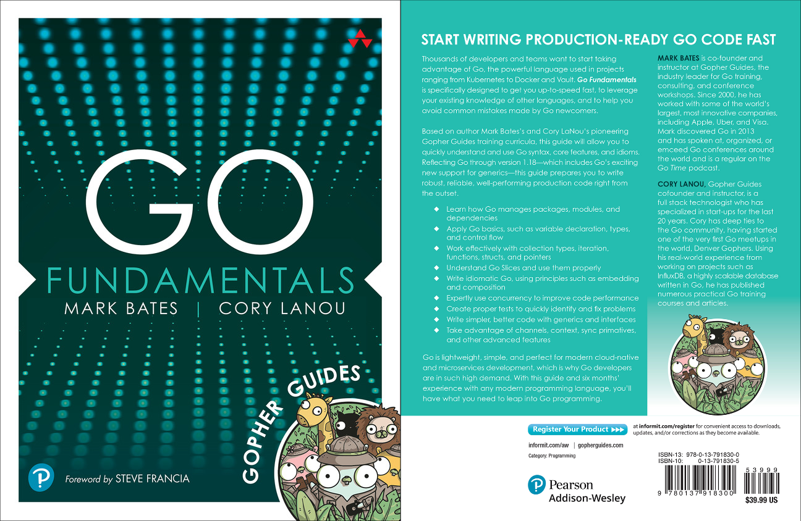

# Building Better CLIs

## Gopher Guides

## Go Fundamentals

# Building Better CLIs

- Avoiding Globals
- Cleaner Code
- Easily Testable
- Composable CLI Apps
- Framework/3rd Party Free!\*

## The Library

<figure id="library">

<go doc="github.com/markbates/bostongo.Walker"></go>

<figcaption>[walker.go](./walker.go)</figcaption>

</figure>

## Four Commands

- `walker` - simple CLI app
- `server` - an HTML server
- `bostongo` - a combined CLI app
  - `garlic` - generates a garlic app (_bonus_)

<include src="_globals.md"></include>

<include src="_walker.md"></include>

<include src="_server.md"></include>

<include src="_bostongo.md"></include>

<include src="_garlic.md"></include>

<include src="_summary.md"></include>

# Go Fundamentals

# Gopher Guides

